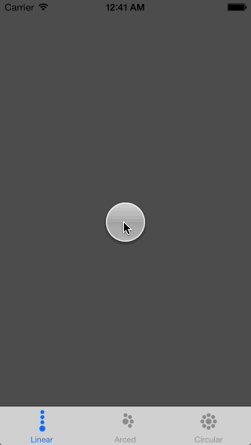

# DLWidgetMenu

**DLWidgetMenu** is a versatile solution for displaying widget menus and can easily be extended with custom layouts and/or animations.

## Preview


## Features

**DLWidgetMenu** comes with three built-in layouts:

* `DLWMLinearLayout`
* `DLWMRadialLayout`
* `DLWMSpiralLayout`

**DLWidgetMenu** uses iOS7's **spring animations** (`DLWMSpringMenuAnimator`) by default, but can easily be provided with your own **custom animations** as well (by subclassing `DLWMMenuAnimator`).
**DLWidgetMenu** observes its menu items for these **gesture recognizer events**:

* single tap
* double tap
* long press
* pan
* pinch

and **forwards them** directly to its **delegate**.

None of these events make **DLWidgetMenu** do anything by default.  
The menu (by default) **doesn't even open**, when you **tap it**!

And **it shouldn't**.

**DLWidgetMenu** was specifically **designed** to keep you in full control over **its behaviour**. All it does is animating and layouting its menu items. Keeping **you in total charge** of **what to do** and **when**.

Assuming you do want **DLWidgetMenu** to open when single-tapped, all you need to do is implement this in your `DLWMMenuDelegate`:

```objc
- (void)receivedSingleTap:(UITapGestureRecognizer *)recognizer onItem:(DLWMMenuItem *)item inMenu:(DLWMMenu *)menu {
	if ([menu isClosedOrClosing]) {
		[menu open];
	} else if ([menu isOpenedOrOpening]) {
		if (item == menu.mainItem) {
			[menu close];
		} else {
			[menu closeWithSpecialAnimator:[[DLWMSelectionMenuAnimator alloc] init] forItem:item];
		}
	}
}
```

As you can see the delegate makes **DLWidgetMenu** use a custom animator for the tapped menu item by calling:

```objc
[menu closeWithSpecialAnimator:[[DLWMSelectionMenuAnimator alloc] init] forItem:item];
```

(The built-in `DLWMSelectionMenuAnimator` applies a **scale-up** in combination with a **fade-out**.)

Don't want that? Fine, just call `[menu close];` then.

Okay, tapping is pretty standard stuff, right? Nothing too fancy.
So how about **moving** a **menu around** using a **pan gesture**? Piece of cake:

```objc
- (void)receivedPan:(UIPanGestureRecognizer *)recognizer onItem:(DLWMMenuItem *)item inMenu:(DLWMMenu *)menu {
	// NSLog(@"%s", __FUNCTION__);
	if (item == menu.mainItem) {
		[menu moveTo:[recognizer locationInView:menu.superview] animated:NO];
	}
}
```
****
It's worth mentioning here that one should usually prefer `[menu moveTo:… animated:…];`  over `menu.center = …;` (while the menu is open, that is).

The reason for this is that **DLWidgetMenu** shrinks to just wrap its main item when closed and stretches to fit its superview when opened (in order to catch tap events outside its menu items). Just enable the debugging-mode (`menu.debuggingEnabled = YES;`) and you should get an idea of what this means.

## Installation

Just copy the files in `"DLWidgetMenu/Classes/..."` into your project.

Alternatively you can install DLWidgetMenu into your project with [CocoaPods](http://cocoapods.org/).  
Just add it to your Podfile: `pod 'DLWidgetMenu'`

## Demos

**DLWidgetMenu** contains a demo app giving you a quick overview of all three included layouts.

## ARC

**DLWidgetMenu** uses **automatic reference counting (ARC)**.

## Dependencies

None.

## Creator

Vincent Esche ([@regexident](http://twitter.com/regexident))

## License

**DLWidgetMenu** is available under a **modified BSD-3 clause license** with the **additional requirement of attribution**. See the `LICENSE` file for more info.